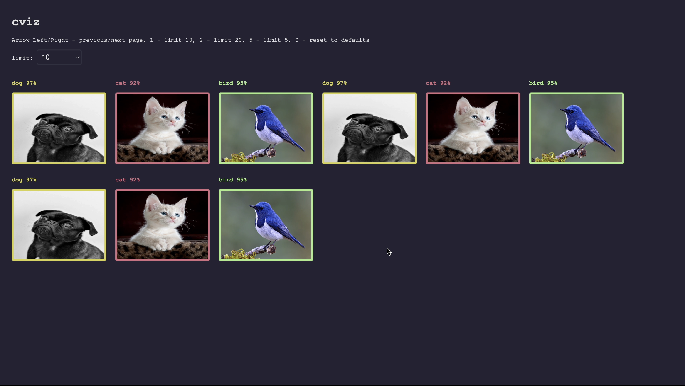

# cviz

Visualization tool, designed for image classification.
It generates HTML from JSON and opens a web browser.




## Install

```sh
go install github.com/piotrpersona/cviz@latest
```

## Usage

```sh
cviz input.json
```

JSON must be in format:
```json
{
    "classes": [
        "peacock",
        "bird",
        "sunflower"
    ],
    "objects": [
        {
            "file": "/path/to/peacock.jpeg",
            "label": 1,
            "class": 0,
            "score": 0.97
        }
    ]
}
```

Properties:
- `file` - absolute path to image on local disk
- `label` - ground truth class index
- `class` - predicted class index
- `score` - predicted score for given class


Example in [./examples](./examples).

## Manual

- Left/Right - navigation
- 1 - limit 10
- 2 - limit 20
- 5 - limit 5

