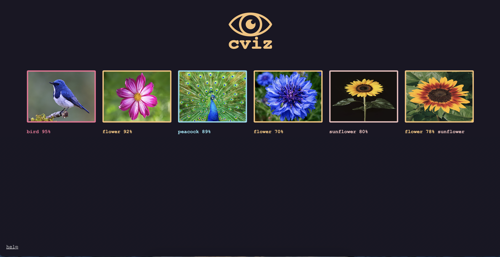

# cviz

Visualization tool, designed for image classification.
It generates HTML from JSON and opens a web browser.




## Install

```sh
go install github.com/piotrpersona/cviz@latest
```

## Usage

```sh
cviz input.json
```

JSON must be in format:
```json
{
    "classes": [
        "peacock",
        "bird",
        "sunflower"
    ],
    "objects": [
        {
            "filePath": "/path/to/peacock.jpeg",
            "class": 0,
            "scores": [
                0.97,
                0.02,
                0.01
            ]
        }
    ]
}
```

Example in [./examples](./examples).

## Manual

- Left/Right - navigation
- 1 - limit 10
- 2 - limit 20
- 5 - limit 5

